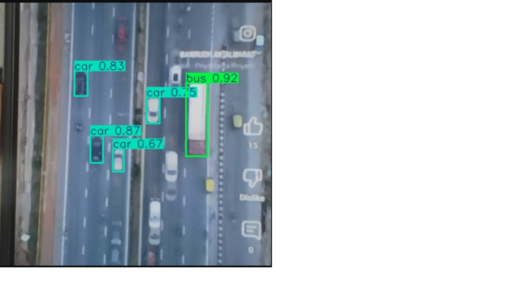

# YOLOv10 Real-Time Webcam Object Detection and Streaming

A real-time object detection project using **YOLOv10** and a **Flask-based web server** that:

- Captures webcam video input
- Runs live YOLOv10 inference
- Streams annotated frames to any browser on the local network
- Is fully containerized via Docker for easy deployment



---

## 🚀 Features

- ✅ Trained on VisDrone dataset
- ✅ Supports webcam as live input
- ✅ Live browser stream with bounding boxes
- ✅ Optimized for 30–60 FPS (with tuning)
- ✅ Easy deployment with Docker

---

## 📦 Requirements

Install Python packages:

```bash
pip install -r requirements.txt
```

Contents of `requirements.txt`:
```txt
ultralytics
opencv-python
flask
flask-cors
```

---

## 🧠 How It Works

1. `app.py` starts a Flask server
2. Captures frames from your default webcam (`cv2.VideoCapture(0)`)
3. Runs detection using your `best.pt` YOLOv10 model
4. Streams the frames to a browser via `/video` route

---

## 🔧 Usage (Python)

```bash
python app.py
```
Visit: [http://localhost:5000/video](http://localhost:5000/video)

---

## 🐳 Docker Deployment

Build and run with:

```bash
docker build -t yolov10-stream .

docker run --rm -it --gpus all \
    --device=/dev/video0 \
    -p 5000:5000 \
    yolov10-stream
```

---

## 📁 Project Structure

```bash
.
├── app.py              # Flask server
├── best.pt             # Trained YOLOv10 model (download separately if needed)
├── Dockerfile          # Docker deployment
├── requirements.txt    # Python dependencies
├── sample_frame.jpg    # Example output
```

---

## 🧪 Training Your Own Model

This repo assumes you already have a trained YOLOv10 model (`best.pt`).
You can train using Ultralytics YOLO CLI or directly via Python.

For example:
```bash
!yolo task=detect mode=train model=yolov10n.pt data=data.yaml epochs=100 imgsz=640
```

---

## 🙌 Acknowledgments

- [THU-MIG YOLOv10](https://github.com/THU-MIG/yolov10)
- [Ultralytics](https://github.com/ultralytics/ultralytics)
- [VisDrone Dataset](https://github.com/VisDrone/VisDrone-Dataset)

---

## 📬 Connect With Me

If you're building anything around embedded vision, real-time ML, or robotics — let's connect!

Feel free to fork, star ⭐, and open issues or PRs. :)
